# TAJANY_KHAOULA_EBank
<h1> FrontEnd</h1>
<h3> Customers</h3>
<h5>La liste des customers se présente comme ceci:</h5>
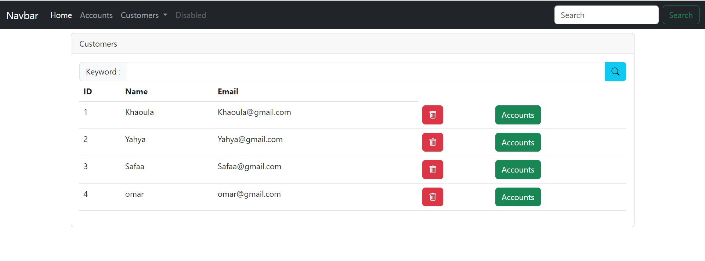

Pour rechercher un client, on tape un keyword et clique sur rechercher:

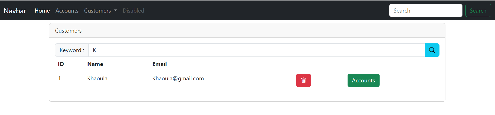

<h5>L'ajout d'un nouveau customer':</h5>

Des vérifications sont faites au niveau de la saisie, et un alert d'information s'affiche.

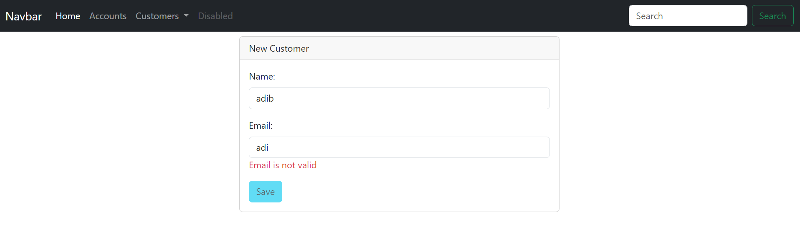
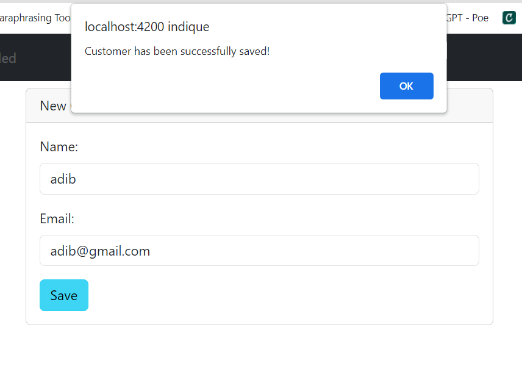

Une fois ajouté, on se redirige vers la liste des customers où on voit bien l'ajoiut du client

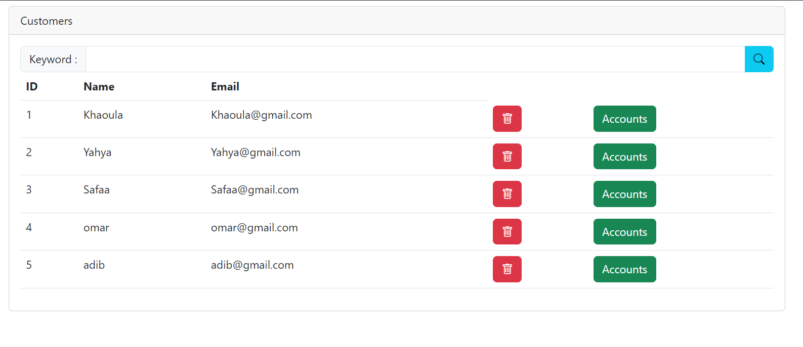

<h5>La suppression d'un customer':</h5>

Pour supprimer, un alert s'affiche pour comfirmer la suppression

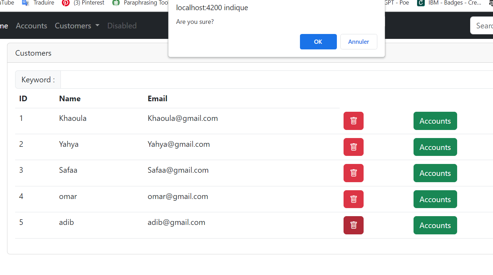
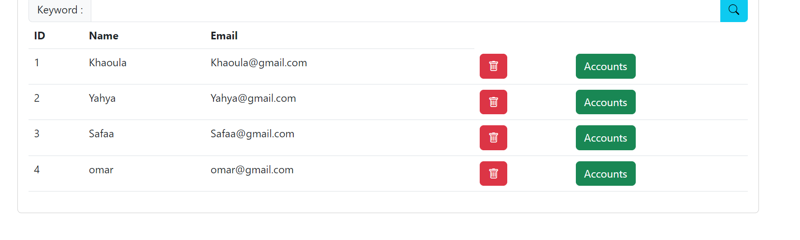

<h5>Details simple d'un compte customer':</h5>
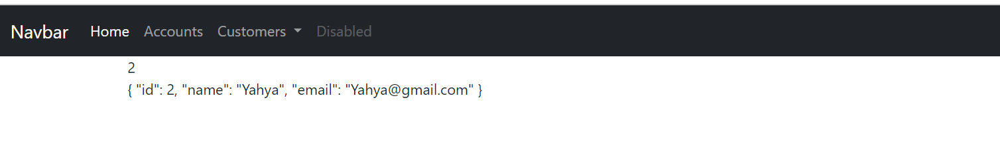

<h3>Accounts</h3>

Pour voir les détails d'un compte:

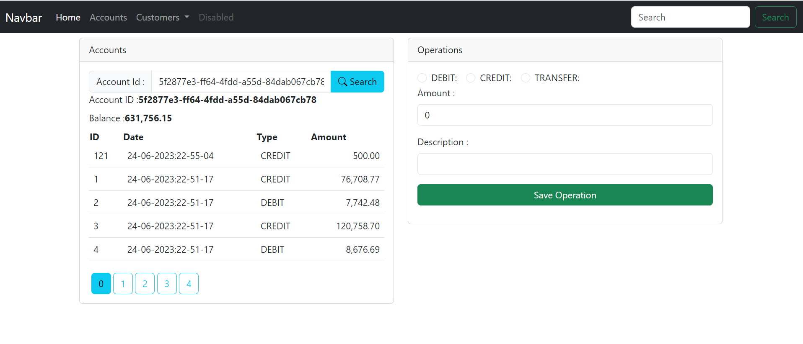

Pour effectuer une opération, dans ce cas c'est un débit:

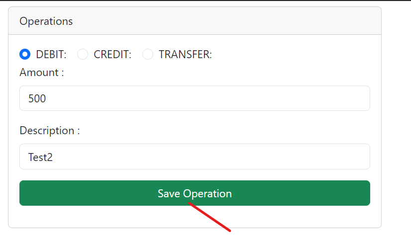
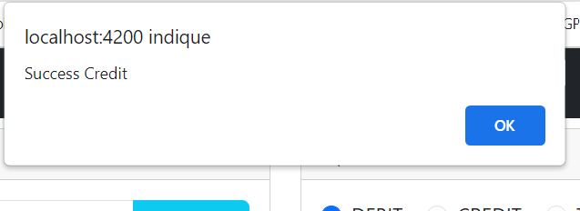

On remarque bien l'ajout de la dernière opération dans la liste d'historiques

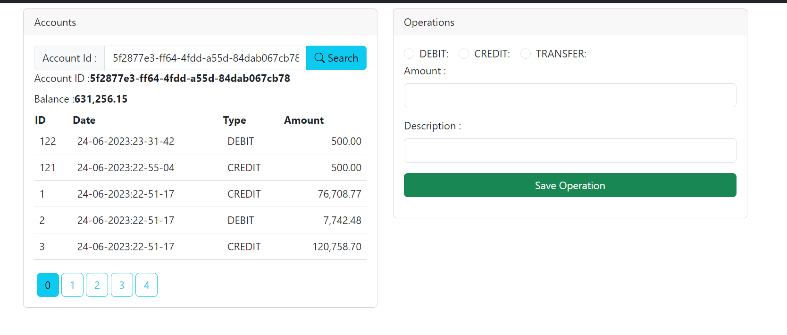

